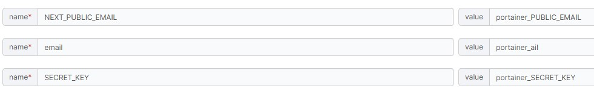

# My Next.js App

This is a simple Next.js application built with React. It serves as a starting point for building web applications using Next.js.

## Project Structure

```
MY-NEXT-APP
├── pages
│   ├── api
│   │   ├── env.ts          # API route to fetch environment variables
│   │   └── log-secret.ts   # API route to log SECRET_KEY
│   ├── index.tsx           # Main entry point of the application
│   └── _app.tsx            # Custom App component for layout persistence
├── public
│   └── favicon.ico         # Favicon for the application
├── styles
│   └── globals.css         # Global CSS styles
├── .env                    # Environment variables
├── docker-compose-portainer.yml # Docker Compose configuration
├── Dockerfile              # Dockerfile for building the Docker image
├── next.config.js          # Next.js configuration file
├── package.json            # npm configuration file
├── tsconfig.json           # TypeScript configuration file
└── README.md               # Project documentation
```

## Setup Instructions

1. Clone the repository:
   ```sh
   git clone https://github.com/TommyWU-20170416/next-portainer.git
   cd MY-NEXT-APP
   ```

2. Install dependencies:
   ```sh
   npm install
   ```

3. Create a `.env` file in the root directory and define your environment variables:
   ```properties
   NEXT_PUBLIC_EMAIL=your_next_public_email
   email=your_email
   SECRET_KEY=your_secret_key
   ```

4. Open your browser and navigate to `http://localhost:3000` to see the application in action.

## Usage

- 打開 localhost:3000 查看顯示的內容

## License

This project is licensed under the MIT License.

---

## 實戰 PORTAINER

### 前置認知

#### 如何改變 NEXT_PUBLIC_*？

- 編譯時決定：
  - Next.js 在執行 next build 的時候，會將所有 NEXT_PUBLIC_* 開頭的環境變數的值編譯進去，並嵌入到靜態資源（例如 JavaScript 和 HTML）中。這些變數的值會被寫死到編譯出來的檔案中，而這些檔案隨後會被部署到 Docker 容器中。

- Docker 跑的是已編譯的 Image：
  - 當你在 Docker 上運行容器時，實際運行的是已經編譯過的 靜態檔案。在這個階段，容器中的環境變數或是 .env 檔案對這些已經編譯好的靜態資源不會有任何影響。即使你在 Docker 中設置了新的 NEXT_PUBLIC_* 環境變數，這些值也不會影響到容器內的靜態資源。

#### 怎麼做才能動態調整 NEXT_PUBLIC_*？

- 在 Docker build 時設置環境變數：
   ```
   # Dockerfile 範例
   ARG NEXT_PUBLIC_API_URL
   ENV NEXT_PUBLIC_API_URL=${NEXT_PUBLIC_API_URL}
   ```

- docker-compose.yml 中設置這些環境變數：

   ```
   version: '3.8'
   services:
     web:
      build:
        context: .
        args:
          NEXT_PUBLIC_API_URL: ${NEXT_PUBLIC_API_URL}
      environment:
        NEXT_PUBLIC_API_URL: ${NEXT_PUBLIC_API_URL}
   ```


### 使用 PORTAINER

- 執行 `docker build -t my-next-app .` 進行 image 編譯
- 編譯後可在 portainer 的 stack 內指定要創建的 image內指定要創建的 image，可參考[ portainer要寫的 stack](docker-compose-portainer.yml)
- 指定想要改變的環境變數
  - 由於此時已經編譯成 image ，故 NEXT_PUBLIC 的變數都無法指定
- 可以嘗試改變非 NEXT_PUBLIC 開頭的，如下圖
