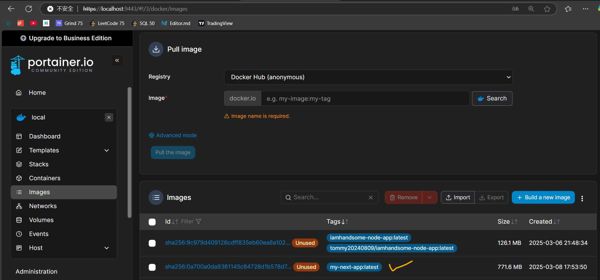
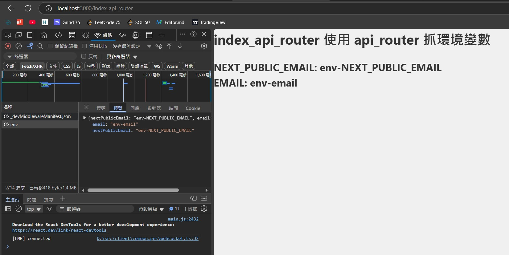
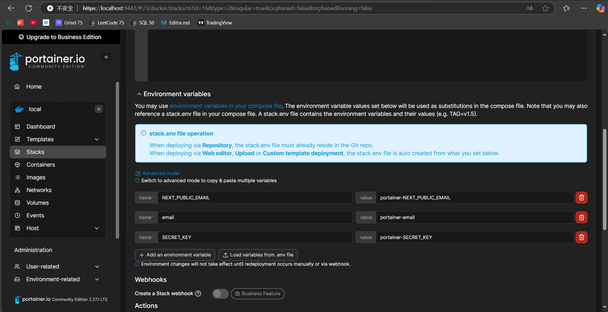

# My Next.js App

This is a simple Next.js application built with React. It serves as a starting point for building web applications using Next.js.

## Project Structure

```
MY-NEXT-APP
├── pages
│   ├── api
│   │   ├── env.ts          # API route to fetch environment variables
│   │   └── log-secret.ts   # API route to log SECRET_KEY
│   ├── index.tsx           # Main entry point of the application
│   └── _app.tsx            # Custom App component for layout persistence
├── public
│   └── favicon.ico         # Favicon for the application
├── styles
│   └── globals.css         # Global CSS styles
├── .env                    # Environment variables
├── docker-compose-portainer.yml # Docker Compose configuration
├── Dockerfile              # Dockerfile for building the Docker image
├── next.config.js          # Next.js configuration file
├── package.json            # npm configuration file
├── tsconfig.json           # TypeScript configuration file
└── README.md               # Project documentation
```

## Setup Instructions

1. Clone the repository:
   ```sh
   git clone https://github.com/TommyWU-20170416/next-portainer.git
   cd MY-NEXT-APP
   ```

2. Install dependencies:
   ```sh
   npm install
   ```

3. Create a `.env` file in the root directory and define your environment variables:
   ```properties
   NEXT_PUBLIC_EMAIL=your_next_public_email
   email=your_email
   SECRET_KEY=your_secret_key
   ```

4. Open your browser and navigate to `http://localhost:3000` to see the application in action.

## Usage

- 打開 localhost:3000 查看顯示的內容

## License

This project is licensed under the MIT License.

---

## 實戰 PORTAINER

### 前置認知

#### 如何改變 NEXT_PUBLIC_*？

- 編譯時決定：
  - Next.js 在執行 next build 的時候，會將所有 NEXT_PUBLIC_* 開頭的環境變數的值編譯進去，並嵌入到靜態資源（例如 JavaScript 和 HTML）中。這些變數的值會被寫死到編譯出來的檔案中，而這些檔案隨後會被部署到 Docker 容器中。

- Docker 跑的是已編譯的 Image：
  - 當你在 Docker 上運行容器時，實際運行的是已經編譯過的 靜態檔案。在這個階段，容器中的環境變數或是 .env 檔案對這些已經編譯好的靜態資源不會有任何影響。即使你在 Docker 中設置了新的 NEXT_PUBLIC_* 環境變數，這些值也不會影響到容器內的靜態資源。

#### 怎麼做才能動態調整 NEXT_PUBLIC_*？

1. 由 docker file 指定環境變數，再用 docker-compose 去運行 docker file
  - 在 Docker build 時設置環境變數：
    ```
    # Dockerfile 範例
    ARG NEXT_PUBLIC_API_URL
    ENV NEXT_PUBLIC_API_URL=${NEXT_PUBLIC_API_URL}
    ```

  - docker-compose.yml 中設置這些環境變數：
    ```yml
    version: '3.8'
    services:
      web:
        build:
          context: .# 這裡沒有指定 dockerfile，Docker 會預設 context 的目錄，在這裡是 '.' 意思就是當前目錄下找 `Dockerfile`
          args:
            NEXT_PUBLIC_API_URL: ${NEXT_PUBLIC_API_URL}
        environment:
          NEXT_PUBLIC_API_URL: ${NEXT_PUBLIC_API_URL}
    ```
  > :no_good: 缺點：僅限於本地去運作，因為 portainer 內的 stack 是在 docker 內，不像是在本地運行，都可以看到所有的資料夾，必須要上傳到 portainer 的 docker 內，或是指定 git repo url 也行。[連結](https://portal.portainer.io/knowledge/can-i-build-an-image-while-deploying-a-stack/application-from-git)


### 使用 portainer

> 以下示範皆為使用本地編譯後的 image，再上去 portainer 去進行部屬以及環境變數調整

#### 1. 基本操作
- 執行 `docker build -t my-next-app .` 進行 image 編譯
- 編譯後可 image list 內看到
- 把 [docker-compose-portainer-without-env.yml](docker-compose-portainer-without-env.yml) 貼到 portainer stack 內
  - 由於 portainer 如果沒有上傳 .env file 或是在網站上 add env，無法使用`env_file:stack.env`，會有以下的錯誤
    - `Failed to deploy a stack: failed to resolve services environment: env file /data/compose/14/stack.env not found: stat /data/compose/14/stack.env: no such file or directory`
- 接著就可以進行 deploy stack
- 啟動後可以到 `http://localhost:3000/index_basic` 檢查網站是否部署正常，以及 console 內是否有顯示 `email: env-email`
  - `email`為非 NEXT_PUBLIC 開頭的變數，所以無法在 html 上呈現

#### 2. 使用 api-router 去抓到 環境變數
> :anguished: 由於先前已知 .env 的 NEXT_PUBLIC 都是編譯期決定，為了獲得動態環境變數，就是把 NEXT_PUBLIC 的變數都拿掉前綴，但這樣要怎麼正常顯示在 html 上呢

其中一解使用 api-router

### portainer + api-router

> portainer stack 的 env 後面都會叫做 stack.env

#### api-router
1. 創建一個抓取 env 的方式 [env.ts](pages/api/env.ts)
2. 在網站內調用 [index_api_router.tsx](pages/index_api_router.tsx)
3. 本地啟動服務
4. 可以看到正常抓到 env 內容，且不管有無 NEXT_PUBLIC 都可以抓到:clap::clap:
  > :no_good: 缺點：由於使用 api_router，所以不能回傳敏感資訊，因為這段會是在 F12 內可以看到的 fetch 資訊



#### 部署 portainer + 本地 .env
1. 使用 [docker-compose-portainer-with-api-router.yml](docker-compose-portainer-with-api-router.yml) 創建 stack
2. Load variables from .env file -> 上傳本地的 [.env](.env)
3. deploy the stack
4. 到 `http://localhost:3000/index_api_router` 看是否有正常抓到環境變數

#### 部署 portainer + stack.env 環境變數修改
1. 到 stack 內修改 stack.env 內容。點選 stack 進去後找到 Editor 頁，到下面展開 Environment variables 然後編輯如下圖

2. 編輯後點選 `Update the stack` 就會重新部署
3. 此時檢查是否網站有更新修改的環境變數
4. 可以發現到 `沒有 NEXT_PUBLIC` 的有正常改變到

#### 部署 portainer + stack.env 環境變數修改 + stack.yml 環境變數
1. 根據上面的 `部署 portainer + stack.env 環境變數修改` 接著在 docker-compose 添加環境變數 [docker-compose-portainer-with-api-router-and-env.yml](docker-compose-portainer-with-api-router-and-env.yml) 就可更新
3. 順序是 portainer 的 stack > stack.env > .env